# Copilot


[With GitHub Copilot, get suggestions for whole lines or entire functions right inside your editor.](https://copilot.github.com/)

## Some feedbacks on copilot usage

---

## 100% match


---

## 90% match but 100% in the intent

Here I just started to write the function signature, and copilot inferred all the code that should be in that function.
Copilot did infer correctly that the code inside the function is about to change a markdown file, but he proposed to modify the `README.md` which is not the right one.

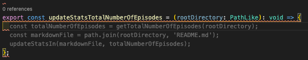

Final version:

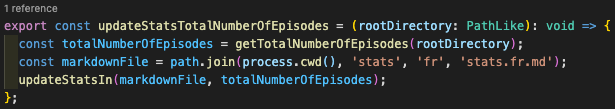

---

## 0% match at first  — then 100% match when coding line by line - then complete failure

Here I just started to write the function name and signature, and copilot could not infer something useful from the function signature.

The idea of that function is, given the start date of a project and given the percentage of the `done` as of today, estimate the end date of the project.

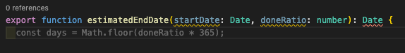

Then after googling, I found the first step of the code should be to find the elapsed days from the start of the project (yes, I know I am a stupid developer), so I just started to type `const elap` :

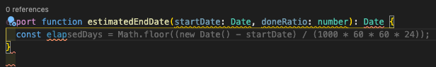

Not so bad, after all!

Then I told me: now I have to get the number of remaining days from what has already been done, so I just started to type `const rema` :

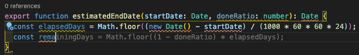

Oh, great! 

Could it be possible that if I define a variable named `endDate` at the next line that `copilot` gives me the solution?

So I just started to type `const endDate` :

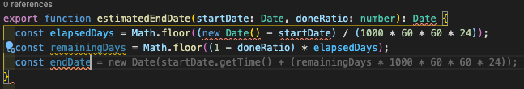

And final result is:

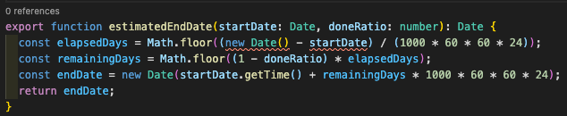

But... wait, I have red squiggles in my code and could not get rid of it! How is it possible?

Go back to googling (Oh yes I am really stupid) and found it: `copilot` think I am a JavaScript coder, but I am writing my code in Typescript!

Ok dear pair-programer `copilot`, let me pilot now to polish the final code:

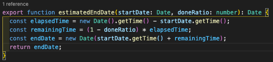

Ok great ! Thanks to `copilot`, I have a great function ready to be used.

Now the following test should be green, isn't ?  

```gherkin
Given I started my Github project on 2019-08-08
And I have achieved 50% of it as of now (2021-08-08)
Then the estimated end date should be 2023-08-08
```

Hold on! The test is RED !!! The computed estimated end date is `2020-11-19` : my project is about to finish in the past !

What's wrong ?

Ah, ah, I should add the remaining time not to the start date but to the `now` date instead.

Now listen to me dear `copilot` and learn from a real developer :

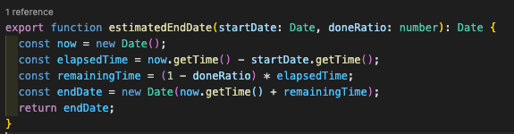

Houra ! Now the above test is green !!!

Let's try another test dear `copilot` just to show that you and I are the best pair:

```gherkin
Given I started my Github project on 2020-08-08
And I have achieved 10% of it as of now (2021-08-08)
Then the estimated end date should be 2030-08-08
```

Hey ! W... T..... F...., test is RED !!! The estimated date is `2022-07-03`.

Hum, after doing some math on a small piece of paper, I realized that the code should be :

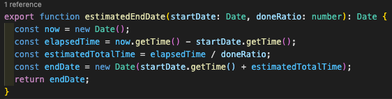

Above test, still not green, but estimated date is now `2030-08-13` which is very near to what it should be.

### Conclusion for this use case

In some situation, `copilot` might drive you in the wrong direction without you noticing that at the end your code is buggy.

Always ensure you have a good testing strategy when using `copilot`.

TDD coding should be the recommended way to pair with `copilot`.

---

## 100% match

I just started to write this function name and signature : 

`function isJson(content: string): boolean`

and immediate feedback from my fellow pair-programmer:

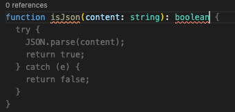

---
